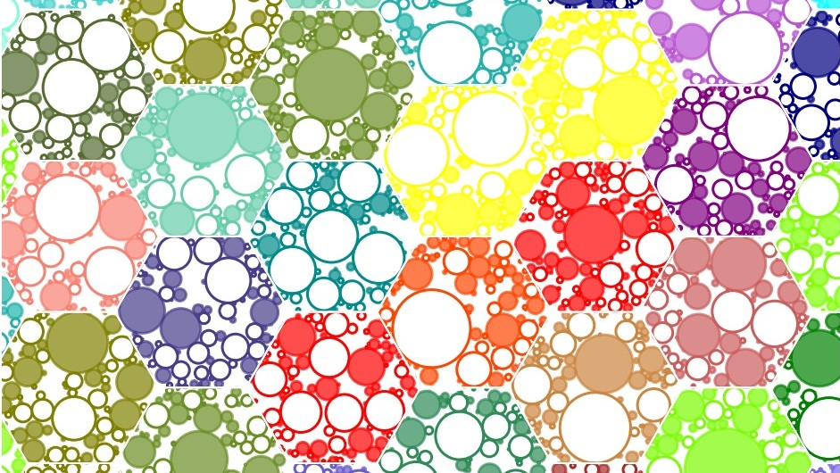

`Hexagons` is an expressive Plotting framework, built on top of Python's Matplotlib.
It allows the user to draw and plot a whole grid of hexagons to various specifications, and to decorate
them using a high-level syntax.

# Gallery

An assortment of Hexagon Images rendered using this framework can be found
[here](http://ram-n.github.io/hexagons-gallery)

# Example Jupyter Notebooks

There are over two dozen Example Jupyter notebooks in which the usage of the hexagons framework is shown.

# Documentation

[Hexagons documentation](https://ram-n.github.io/hexagons/) on Github.

# Installation

Needs Matplotlib and Python >=3.5.
And then just clone this repository (which has the *.py files) that are to be included.

    cd <directory you clone>
    edit a <script.py>

# About
In April of 2020, in the midst of worldwide pandemic, I (Ram) started dabbling with generating geometric art using Matplotlib, using a regular grid of hexagons as the basis. For that, I created a set of helper functions
for repetitive tasks.

The project grew and grew and then I ended up adding Example Jupyter notebooks and Documentation. There are over 20 stand-alone notebooks that can be run to generate various images with a large number of parameters specified.