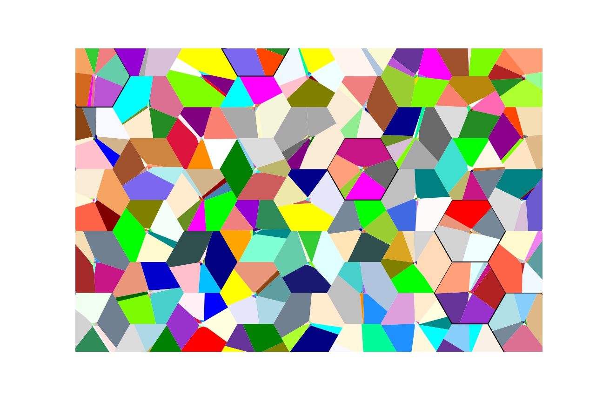
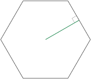

Glossary Hexagons
=================

.. glossary::

    Apotherm
        |apo| The apothem (sometimes abbreviated as apo) of a regular polygon is a line segment from 
        the center to the midpoint of one of its sides. Equivalently, it is the line drawn 
        from the center of the hexagon that is perpendicular to one of its sides (edges). The 
        word "apothem" can also refer to the length of that line segment. 

    Edge
        Any of the six sides of a hexagon.

    emp
        Edge Mid Point. The mid-point of each edge of the hexagon, six in all.

    etp
        Edge trisect points. Two interior points per edge of hexagons, 12 in all.

    Flat
        Refers to the orientation of the hexagon on the screen, where the topmost part of the hexagon is 
        a horizontal edge. A hexagon can either be Flat or :term:`Pointy-topped`.

    height
        Refers to the height of a regular hexagon.

    Inradius
        The radius of a circle inscribed in the regular hexagon is equal to a 
        half of its height, which is also the apothem: r = √3/2 * size

    Pointy-topped
        Refers to the orientation of the hexagon on the screen, where the topmost part of the hexagon is a point,
        the place where two edges are meeting at a vertex.
        A hexagon can either be Pointy-topped or :term:`Flat`.

    Size
        The size of a regular hexagon is the length of one :term:`Edge`. Sometimes this is also referred to as 
        the radius of the hexagon. See also :term:`Inradius`.

    Spoke
       to be written     
       
    Vertex
       to be written     
       
    x-axis
       to be written     
       
    y-axis
       to be written     
       
    z-axis
       to be written     

    xat
        abbreviated form of an Xattitude, which are simply lines parallel to the 
        horizontal x-axis. See also :term:`Yattitude <yat>` and :term:`Zattitude <zat>`.

    yat
        abbreviated form of an Yattitude, which are simply lines parallel to the 
        horizontal y-axis. See also :term:`Xattitude <xat>` and :term:`Zattitude <zat>`.

    zat
        abbreviated form of an Zattitude, which are simply lines parallel to the 
        horizontal z-axis. See also :term:`Xattitude <xat>` and :term:`Yattitude <yat>`.

